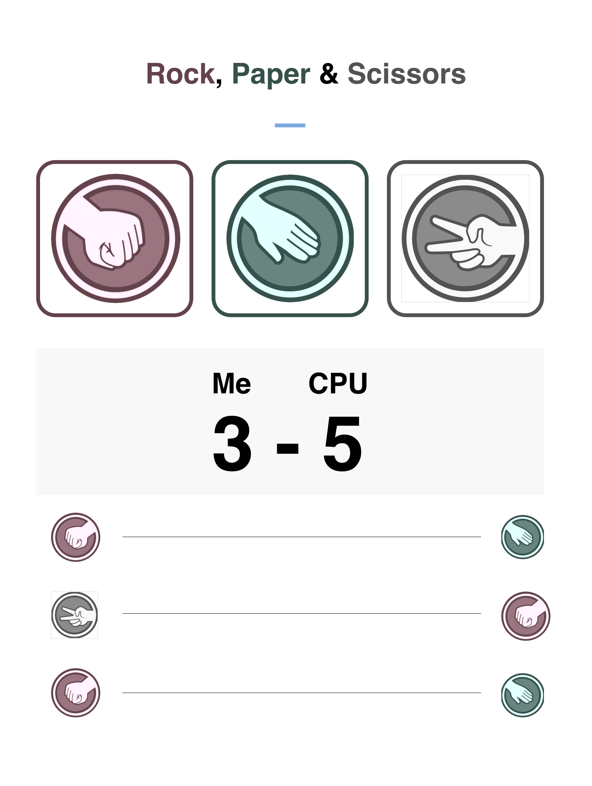

# ReactSchool

## To start your Phoenix app

* Install dependencies with `npm install`
* Start the app with `npm run start`

Now you can visit `localhost:3000` from your browser.

Once you have the app up and running, try to make this app in React.

